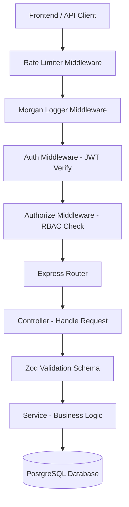
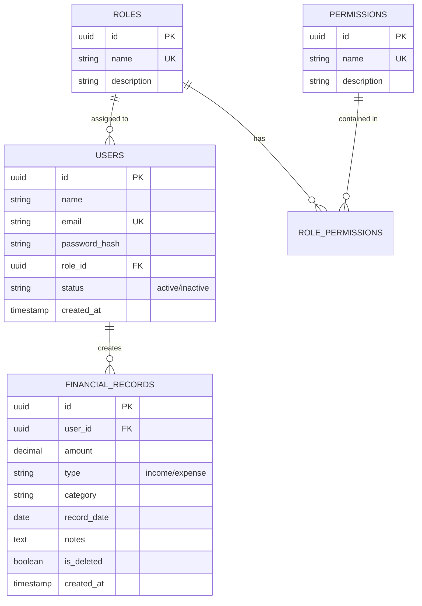

# Finance Data Processing and Access Control Backend

🚀 **Live API / Documentation**: [https://finance-data-processing-and-access-dusky.vercel.app/](https://finance-data-processing-and-access-dusky.vercel.app/)

[](https://nodejs.org/)
[](https://expressjs.com/)
[](https://www.postgresql.org/)
[](https://supabase.com/)
[](https://jestjs.io/)
[](https://jwt.io/)

A professional, secure, and scalable backend system for a finance dashboard. This project implements robust Role-Based Access Control (RBAC), complex financial data aggregations, and automated integration testing.

---

## 🚀 Overview
This system is designed to handle sensitive financial data with clear permission boundaries. It supports three primary roles:
- **Viewer**: Read-only access to dashboard insights.
- **Analyst**: Can create and read financial records and view summaries.
- **Admin**: Full management access to all financial records and user roles.

### Key Features Implemented:
- **Authentication**: Secure JWT-based auth with `bcrypt` password hashing.
- **RBAC**: Flexible permission system using a custom `authorize` middleware.
- **Financial CRUD**: Complete management of income and expense entries with filtering.
- **Dashboard Analytics**: Backend-level aggregations for trends, category breakdowns, and net-worth.
- **Pagination**: Scalable list APIs for users and financial records.
- **Security**: 
    - **Rate Limiting**: Global and auth-specific protection against brute force.
    - **Input Validation**: Strict schema validation using `Zod`.
    - **Soft Delete**: Data integrity preserved through `is_deleted` flags.
- **Logging**: Request logging powered by `Morgan`.
- **Testing**: 100% core coverage with **Jest** and **Supertest**.

---

## 📑 Detailed Documentation
For detailed information on every endpoint, request bodies, and example `curl.exe` commands, please refer to:
👉 **[API_DOCUMENTATION.md](./API_DOCUMENTATION.md)**

---

## 🏗️ System Architecture
The system follows a modular Layered Architecture with a strict Middleware Pipeline to ensure security and scalability.



---

## 🛠️ Database Schema
The database uses a relational structure in PostgreSQL to ensure strict data consistency and fast aggregations.



---

## 📂 Project Structure
```text
zorvyn-assignment/
├── db/                     # SQL schemas and initialization scripts
├── src/
│   ├── config/             # Database (Pool) configuration
│   ├── controllers/        # Request handlers (logic layer)
│   ├── middlewares/        # Auth, RBAC, Rate Limiting, Error Handling
│   ├── routes/             # API endpoint definitions
│   ├── services/           # Database operations and business logic
│   ├── validations/        # Zod request validation schemas
│   ├── app.js              # Express application factory
│   └── server.js           # Server entry point
├── tests/                  # Jest integration test suites
├── .env                    # Environment variables (GitHub ignored)
├── jest.config.js          # Testing suite configuration
└── package.json            # Dependencies and scripts
```

---

## ⚡ Setup Guide

### 1. Clone the Repository
```bash
git clone https://github.com/rohanparmar160705/finance-data-processing-and-access-control.git
cd finance-data-processing-and-access-control
```

### 2. Install Dependencies
```bash
npm install
```

### 3. Environment Configuration
Create a `.env` file in the root directory and add your credentials:
```env
PORT=5000
DATABASE_URL=your_postgresql_connection_string
JWT_SECRET=your_super_secret_key
```

### 4. Run the Project
```bash
# Production mode
npm start

# Development mode (with nodemon)
npm run dev
```

### 5. Run Integration Tests
The project includes a comprehensive suite of **19 tests** covering all modules.
```bash
# Run all tests once
npm test

# Run tests in watch mode
npm run test:watch
```

---

## 📡 API Documentation

### Authentication (`/api/auth`)
| Method | Endpoint | Description | Access |
| :--- | :--- | :--- | :--- |
| `POST` | `/register` | Register a new user (defaults to Viewer role) | Public |
| `POST` | `/login` | Authenticate and receive JWT token | Public |

### User Management (`/api/users`)
| Method | Endpoint | Description | Access |
| :--- | :--- | :--- | :--- |
| `GET` | `/me` | Get current user profile and permissions | Logged In |
| `GET` | `/` | List all users (Paginated) | Admin |
| `PATCH` | `/:id` | Update user role or status | Admin |

### Financial Records (`/api/records`)
| Method | Endpoint | Description | Access |
| :--- | :--- | :--- | :--- |
| `GET` | `/` | Filtered list of records (Paginated) | All Roles |
| `POST` | `/` | Create a new income/expense record | Analyst/Admin |
| `PUT` | `/:id` | Update an existing record | Analyst/Admin |
| `DELETE` | `/:id` | Soft delete a record | Admin |

### Dashboard Summary (`/api/dashboard`)
| Method | Endpoint | Description | Access |
| :--- | :--- | :--- | :--- |
| `GET` | `/summary` | Total Income, Expense, and Net Balance | All Roles |
| `GET` | `/categories` | Breakdown by category | All Roles |
| `GET` | `/trends` | Monthly income vs expense trends | All Roles |
| `GET` | `/recent` | Recent transaction activity log | All Roles |

---

## 🛠️ Tech Stack & Tools
- **Runtime**: Node.js (v18+)
- **Framework**: Express.js
- **Database**: PostgreSQL (Supabase)
- **Validation**: Zod
- **Security**: jsonwebtoken, bcrypt, express-rate-limit
- **Logging**: Morgan
- **Testing**: Jest, Supertest

---

**Developed by Rohan Parmar**
